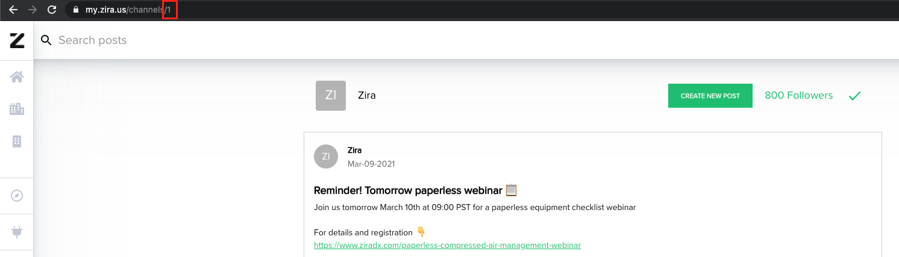

- [Add reading](#add-reading)
  - [Example](#example)
- [Add event](#add-event)
- [Import CSV](#import-csv)
- [Export CSV](#export-csv)
- [Get normalized data](#get-normalized-data)
- [Get aggregated data](#get-aggregated-data)
- [Create post](#create-post)
  - [Example](#example-1)
  - [postTypeId (String)](#posttypeid-string)
  - [content (String)](#content-string)
  - [toChannelId (String)](#tochannelid-string)
- [Create/Edit task](#createedit-task)
  

## Add reading
```
POST /zira-client/reading HTTP/1.1
```
Use this one to add device readings manually.

### Example
```
```

## Add event
## Import CSV
## Export CSV
## Get normalized data
## Get aggregated data
## Create post
```
POST /zira-client/post HTTP/1.1
```
Creates a new post on a chosen channel.
Keep the post type ID = 1 for an ordinary post.

### Example
```
POST /zira-client/post HTTP/1.1
Host: api.zira.us
Content-Type: application/json
Content-Length: 86

{
    "postTypeId": "1",
    "content": "Hello everyone!",
    "toChannelId": "5218"
}
```

### postTypeId (String)
Use one of the below IDs.
```
| Type          | ID   |
| :------------ | :--- |
| Ordinary Post | 1    |
| Alert         | 15   |
```

### content (String)
Body of the post.

### toChannelId (String)
Target channel. 
Checkout the channel number in the address section of the browser.




## Create/Edit task