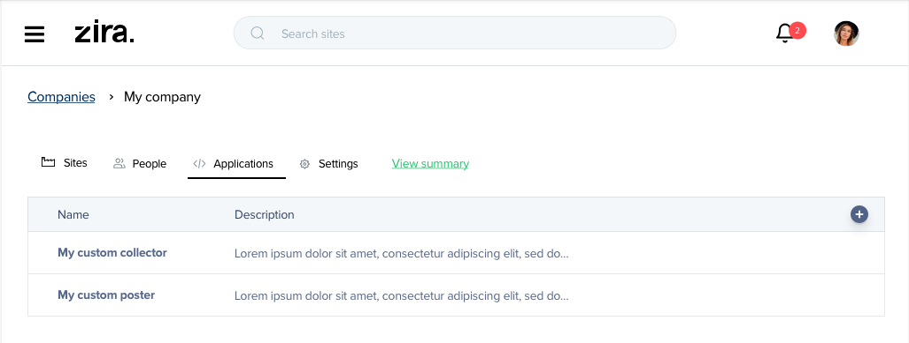

# zira-client
Zira client directory

## Table of Contents
  - [Overview](#overview)
  - [Preparation](#preparation)
  - [Getting started](#getting-started)

## Overview
This simple repository will help you develop easy integration with our system. 

## Preparation
We're using an API key as a way of securing user applications. API key must be added in the request header called X-API-Key.
```
X-API-Key: aa54d7a9-6dd0-5ab2-9834-21ccb953c060
```

- To get an API key, log in to zira.com and go to Applications Tab:

- Click on the + and choose a name for the Application.
- After that you will be presented with an API key.
- Keep that key secure, and don't share it with 3rd party.

## Getting started 
Use your favorit http client to access our API functions. Just for demonstration, we'll use request library.
```
var request = require('request');
var options = {
  'method': 'POST',
  'url': 'https://api.zira.us/ziraSdk/post',
  'headers': {
    'X-API-Key': <your API key>,
    'Content-Type': 'application/json'
  },
  body: JSON.stringify({
      "postTypeId":"1",
      "content":"Hello <mention>4705</mention>",
      "imageId":null,
      "mentions":"{4705}",
      "toChannelId":"5218",
      "fromChannelId":"4705"
    })

};
request(options, function (error, response) {
  if (error) throw new Error(error);
  console.log('New post id: '+response.body.data.id);
});
```